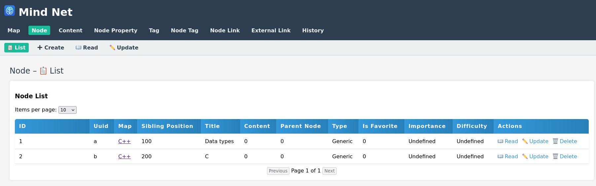
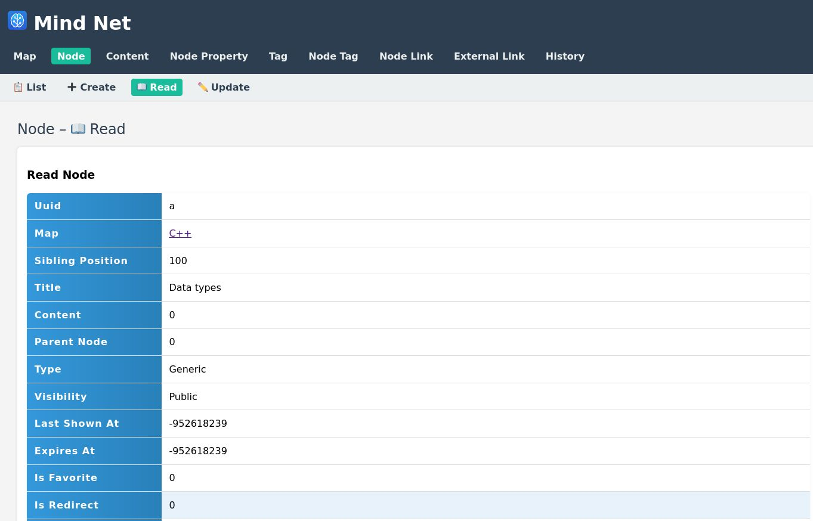
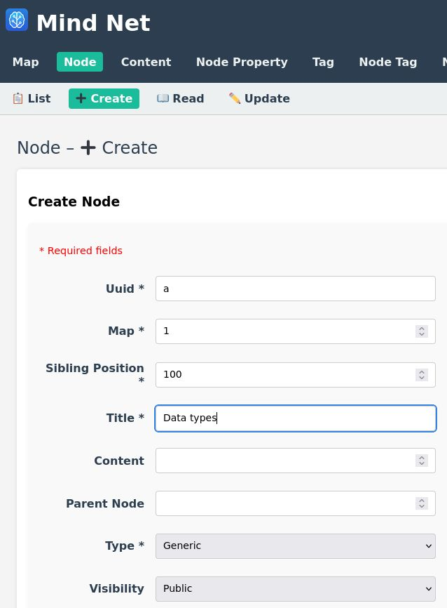
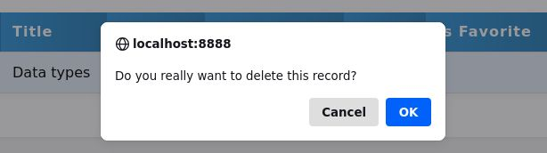
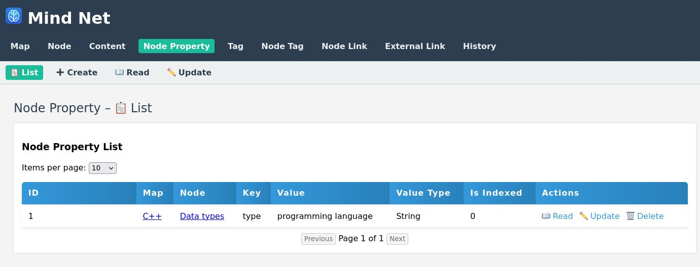
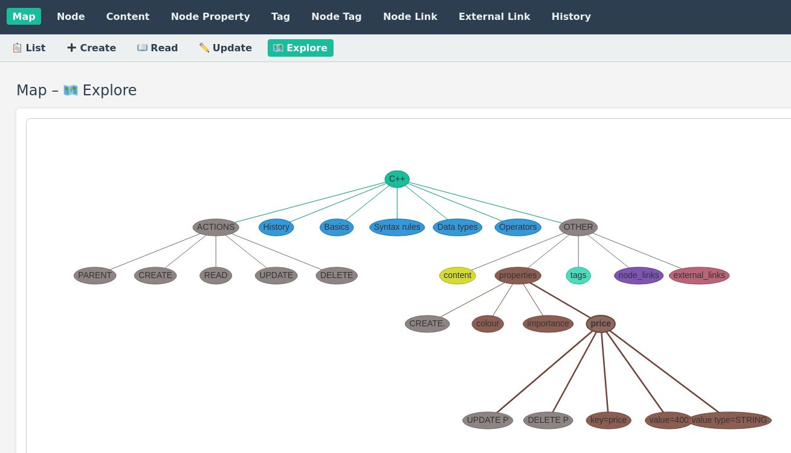
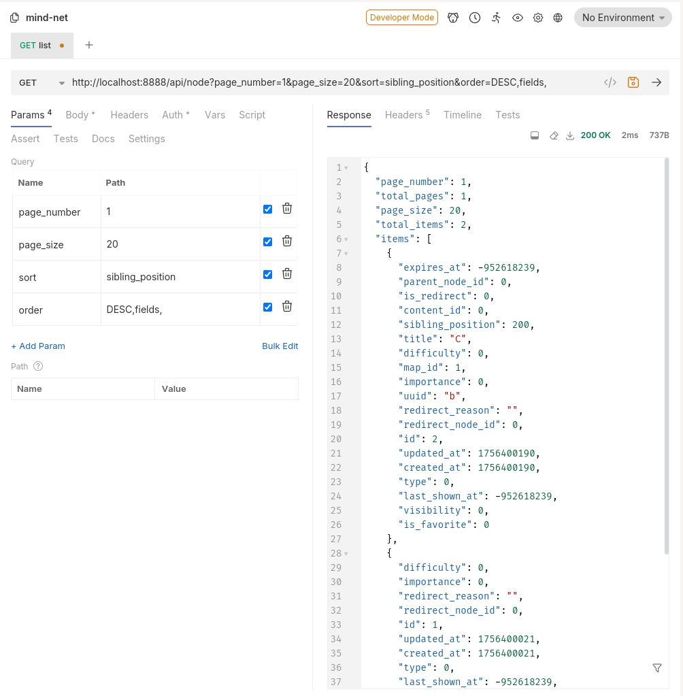

# mind-net

Mind Net is a note taking application written in the C++ programming language:

Requirements:
* Linux
* Windows

Used technologies:
* C++17
* SQLite
* Crow
* CMake

Components:
* C++ Crow backend
* Pure HTML, JavaScript, CSS frontend

## Screenshots

### List nodes



### Read node



### Create node



### Delete node



### List properties



### Graph demo



### Calling get list for node



## How to build

### How to build on Linux

These are the instructions for Debian 13. 
* For other Linux distributions , you may need to install different packages.


```aiignore
# Install dependencies
apt install build-essential libboost-all-dev cmake g++ libcurl4-openssl-dev

# Install git
apt install git

# Clone the repository
git clone https://github.com/openeggbert/mind-net/

# Init git submodules
git submodule update --init --recursive

# Go to the repository
cd mind-net

# Enable FTS5 feature of SQLite : edit third_party/sqlite/CMakeLists.txt
# Add target_compile_definitions(sqlite3 PUBLIC SQLITE_ENABLE_FTS5) 
#to: 

$<INSTALL_INTERFACE:include/>)
target_compile_definitions(sqlite3 PUBLIC SQLITE_ENABLE_FTS5)
if (SQLITE_ENABLE_COLUMN_METADATA)

# Switch to the develop branch
git checkout develop

# Create build directory
mkdir build

# Go to build directory
cd build

# Run cmake
cmake -B . -S ..

# Build
cmake --build .

#Generate JWT Secret
openssl rand -base64 32

#Configure in mindnet.properties

# Run the application
./mind_net start --port 8888 -s /home/johndoe/Desktop/mindnet/frontend
```

# Project TODO / Roadmap

## Legend
- **BUG** – Issues, crashes, or bugs to fix
- **FEATURE** – New functionality or enhancements
- **IMPROVEMENT** – Improvements to existing code
- **DOCUMENTATION** – Docs, guides, README updates
- **TESTING** – Writing or updating tests
- **TASK** – General task or chore
- **QUESTION / DISCUSSION** – Questions, decisions, or discussions
- **PERFORMANCE** – Performance optimization
- **SECURITY** – Security-related changes
- **DEPRECATION / REMOVAL** – Removing old or deprecated code

## BACKLOG

### Critical
- [ ] FEATURE Triggers - also add adding operations (as json) to history table
- [ ] FEATURE User authentication
  * via JWT token /login, which is valid 1 hour (can be configured) ... https://github.com/njligames/crow-jwt-auth
  * refresh token /refresh-token is valid 7 days (can be configured)
  * when the access token expires, the client (e.g. frontend) sends the refresh token and obtains a new access token —
    without requiring re-authentication.
- [ ] Zettelkasten component
- [ ] Test component
- [ ] New table concept : title, disambiguation, note_id
- [ ] New table source: type:book/web, title, author, year, page_number, url, map_id
- [ ] New table idea: string title, string content, bool important, bool public
- [ ] BUG Update of boolean values in SQLite is not working.
- [ ] BUG Action list sometimes fails - AND is missing in the generated SQL statement.
- [ ] FEATURE User authorization via Validators
- [ ] FEATURE Log logging in, registration, logout, password changes
- [ ] IMPROVEMENT QueryParam - add filter(complex json filtering) and query (like '%_%')
- [ ] TASK Check operator== implementations for all models
- [ ] TASK Duplication in read_model and list_models - Both functions have nearly identical logic for reading data — consider refactoring into a shared utility.
- [ ] /logout endpoint
  ```
  CROW_ROUTE(app, "/logout")([](const crow::request& req){
  auto session = req.get_session();
  session.clear(); // logout
  return "Logged out";
  });
  ```

### Extending
- [ ] Improve documentation
- [ ] FEATURE New entity Flag
- [ ] IMPROVEMENT Add logging to files
- [ ] FEATURE Support for export to static HTML files
- [ ] FEATURE Create OpenAPI specification for the REST API
- [ ] IMPROVEMENT Paging - add First and Last buttons
- [ ] FEATURE New entity Task (related to notes) + Markdown content of notes will be parsed for tasks - like in Zim Desktop Wiki + sending e-mail messages, web browser notification, Android toast 
- [ ] ModelDefinition - add title_column
- [ ] bool custom_action.expand]
- [ ] new entity File
- [ ] Frontend : sort and order is missing
- [ ] New entity WantedNote : title, first_seen_in_note_id, first_seen_at
- [ ] New entity Session
- [ ] New table access_token : name, description, expiration_date, bool allow_all_operations, vector<Crudl> global_allowed_operations, vector<std::pair<string, Crudl>> allowed_operations
  ```aiignore
   CREATE TABLE session (
    id INTEGER PRIMARY KEY AUTOINCREMENT,
    user_id INTEGER NOT NULL,
    token TEXT NOT NULL UNIQUE,
    expires_at DATETIME NOT NULL,
    FOREIGN KEY (user_id) REFERENCES user(id) ON DELETE CASCADE
  ```
- [ ] Tree view: via vis.js, clicking on node opens the node in a new tab

### Experimental
- [ ] Chat component - Slack-like
- [ ] FEATURE New table comment_reaction
- [ ] FEATURE New table discussion_read_status
- [ ] FEATURE Support for PostgresSQL storage
- [ ] FEATURE Implement complex Filtering in REST API

### Implement Complex Filtering in REST API

#### Operators and JSON Format

| Operator    | Meaning                               | JSON Format                        |
| ----------- | ------------------------------------- | ---------------------------------- |
| **AND**     | Logical conjunction                   | `{ "and": [A, B] }`                |
| **OR**      | Logical disjunction                   | `{ "or": [A, B] }`                 |
| **NOT**     | Logical negation                      | `{ "not": A }`                     |
| **= / ==**  | Equality                              | `{ "field": { "eq": value } }`     |
| **!=**      | Inequality                            | `{ "field": { "neq": value } }`    |
| **< / >**   | Less than / Greater than              | `{ "field": { "lt": value } }`     |
| **<= / >=** | Less than or equal / Greater or equal | `{ "field": { "lte": value } }`    |
| **IN**      | Value is in a list                    | `{ "field": { "in": [a, b, c] } }` |
| **LIKE**    | Pattern match (substring)             | `{ "field": { "like": "%abc%" } }` |
| **IS NULL** | Field is null                         | `{ "field": { "is_null": true } }` |
| **EXISTS**  | Subquery or presence check            | `{ "exists": { ... } }`            |

---

#### Example: Complex Filter

```json
{
  "and": [
    {
      "or": [
        {
          "and": [
            { "owner": { "eq": 123 } },
            { "visibility": { "eq": "public" } }
          ]
        },
        { "shared": { "eq": true } }
      ]
    },
    { "deleted": { "eq": false } }
  ]
}
```

---


  
### New table comment_reaction

CREATE TABLE comment_reaction (
comment_id INTEGER,
user_id INTEGER NOT NULL,
type TEXT NOT NULL, -- např. 'like', 'heart', 'laugh'
FOREIGN KEY(comment_id) REFERENCES comment(id),
FOREIGN KEY(user_id) REFERENCES user(id)
);

### New table discussion_read_status

CREATE TABLE discussion_read_status (
user_id INTEGER NOT NULL,
discussion_id INTEGER NOT NULL,
last_read_at DATETIME DEFAULT CURRENT_TIMESTAMP,
PRIMARY KEY(user_id, discussion_id),
FOREIGN KEY(user_id) REFERENCES user(id),
FOREIGN KEY(discussion_id) REFERENCES discussion(id)
);

## Done

- [x] IMPROVEMENT Enums will be PascalCase, not all uppercase
- [x] IMPROVEMENT Refactor struct Configuration
- [x] FEATURE new endpoints /info and /health - shows some configuration entries (not all) + other information